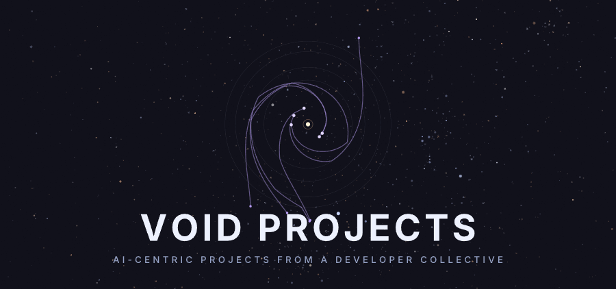

  <picture>
    <source srcset="./assets/void-hero.svg" type="image/svg+xml">
    
  </picture>

### A developer collective building AI-centric tools.

Every project is named after something you would find out in the void.

[Website](https://voidprojects.ai) · [Docs](https://docs.voidprojects.ai) · [Blog](https://voidprojects.ai/blog)

## The Projects

We are building the connective tissue for AI agents: the context they read, the skills they run, and the network they reach across.

| Project | What it is | Where |
| :-- | :-- | :-- |
| **Constellation** | Transform disjointed, amorphic systems into accessible graphs of knowledge that agents can traverse. | _Private beta_ |
| **Protostar** | Agent skills that get better the more you use them. The loop: use → sync → refine → suggest → adopt. | [protostar-cli](https://github.com/voidprojectssoftware/protostar-cli) · [registry](https://github.com/voidprojectssoftware/protostar-registry) · [docs](https://docs.voidprojects.ai) |
| **Wormhole** | A peer-to-peer network so your agent can query a teammate's local context, right inside your harness. | [wormhole](https://github.com/voidprojectssoftware/wormhole) |
| **Space Trash** | The vibe-coded CLI belt that keeps our own lights on. Firmly space trash, and proud of it. | [spacetrash](https://github.com/voidprojectssoftware/spacetrash) |
