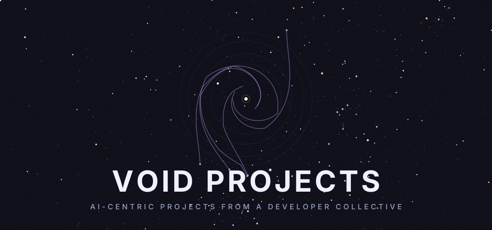

  

### A developer collective building AI-centric tools.

Every project is named after something you would find out in the void.

[Website](https://voidprojects.ai) · [Docs](https://docs.voidprojects.ai) · [Blog](https://voidprojects.ai/blog)

---

## The work

We build the connective tissue for AI agents: the context they read, the skills they run, and the network they reach across. Four projects, one orbit.

| Project | What it is | Where |
| :-- | :-- | :-- |
| **Constellation** | Transform disjointed, amorphic systems into accessible graphs of knowledge that agents can navigate. | _Private beta_ |
| **Protostar** | Agent skills that get better the more you use them. The loop: use → sync → refine → suggest → adopt. | [protostar-cli](https://github.com/voidprojectssoftware/protostar-cli) · [registry](https://github.com/voidprojectssoftware/protostar-registry) · [docs](https://docs.voidprojects.ai) |
| **Wormhole** | A peer-to-peer network so your agent can query a teammate's local context, right inside your harness. | [wormhole](https://github.com/voidprojectssoftware/wormhole) |
| **Space Trash** | The vibe-coded CLI belt that keeps our own lights on. Firmly space trash, and proud of it. | [spacetrash](https://github.com/voidprojectssoftware/spacetrash) |

---

## About the emblem

The mark above is not stock art. It is the real heliocentric trajectory of five deep-space probes — **Pioneer 10 & 11, Voyager 1 & 2, and New Horizons** — pulled from [NASA/JPL HORIZONS](https://ssd.jpl.nasa.gov/horizons/), projected onto the ecliptic plane and drawn on a logarithmic radial scale so the inner gravity-assist swirl blooms while the long cruise to the edge of the solar system compresses into the medallion. The probes trace their real paths outward from the Sun; the faint rings are the orbits of the outer planets.

The stars behind it are real too: the naked-eye night sky from the [HYG catalog](https://github.com/astronexus/HYG-Database), projected from a fixed vantage on Earth and coloured by each star's spectral index — the same sky renderer that runs live on our [website](https://voidprojects.ai).

It is generated, not drawn, by [`scripts/generate-hero.mjs`](./scripts/generate-hero.mjs) — a self-contained animated SVG, no runtime required. The same trajectory system drives the symbol generator on our [website](https://voidprojects.ai).

---

  Void Projects · out here in the dark, building toward the light.

